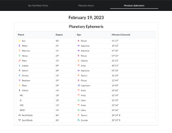

# AstroPage

#### By: Phil Curran

## Technologies Used

- HTML5
- CSS3: Semantic UI Components
- Javascript
- React
- React Router
- Python, Flask, BeautifulSoup

## Description

I built this project in a weekend on a whim. This app provides the day's astronomical and astrological conditions. A Python & Flask backend scrapes data from several websites to provide data to the app's Frontend. The Frontend is built with React and React Router. The app is styled with Semantic UI Components.

## Setup/Installation Requirements

- Clone the repo: `git clone https://github.com/phil-curran/astro-page`
- Install dependencies from root directory: `npm install`
- Install Python packages from root directory: `python pip install requests bs4 datetime flask json`
- Populate the database: `python3 data.py`
- Run the app: `npm start`

## Screenshots

## Known Bugs

- _No Known Issues_

## Future Features

- Fixed text alignment on home page
- Ability to search for and select a location

## Contact

Please contact me if you have issues, questions, or ideas:

- pecurran@outlook.com

## License

MIT

Copyright (c) 202 Phil Curran
